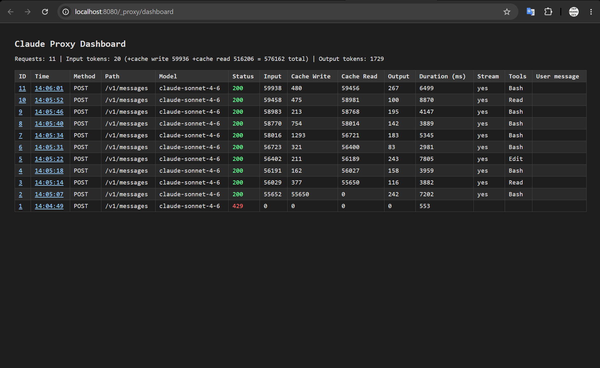
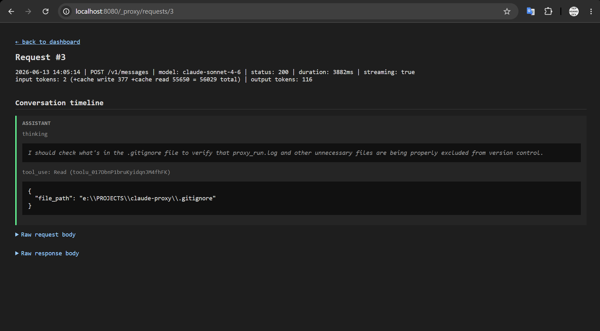

# claude-proxy

A Go reverse proxy for the Claude API (`api.anthropic.com`) that tracks token
usage, tool calls, and conversation content for every request, with a live
dashboard for inspection.

## Features

- Transparent reverse proxy to `https://api.anthropic.com`, including SSE streaming
- Per-request tracking of input/output/cache tokens, model, status, duration, and tool calls
- Live dashboard with request list and per-request conversation timeline
- Optional routing rules (`config.json`): redirect matching models to an
  alternate provider (e.g. DeepSeek) and/or inject extra system-prompt text

## Demo

### Request list



### Request detail / conversation timeline



## VS Code Extension

A companion VS Code extension is available for one-click install, start/stop,
and configuration of claude-proxy. The extension auto-downloads the latest
release binary and provides status bar controls.

### Installation

**Option A: VSIX file (recommended for sharing)**

Download the `.vsix` file from the
[latest GitHub Release](https://github.com/TiepHoangDev/claude-proxy/releases/latest), then
install via command line:

```bash
code --install-extension claude-proxy-vscode-*.vsix
```

Or from within VS Code: **Extensions (Ctrl+Shift+X) → "..." → Install from VSIX...** → select the file.

**Option B: Build from source**

```bash
cd vscode-extension
npm ci
npx vsce package
code --install-extension claude-proxy-vscode-*.vsix
```

### Commands

Open the Command Palette (Ctrl+Shift+P) and type "Claude Proxy":

| Command | Description |
|---|---|
| **Start** | Auto-download the latest binary and start the proxy |
| **Stop** | Stop the running proxy |
| **Restart** | Stop then start again |
| **Open Dashboard** | Open `/_proxy/dashboard` in the browser |
| **Open Setup / Config** | Open `/_proxy/setup` in the browser |
| **Show Logs** | View proxy output in the VS Code Output panel |
| **Check for Binary Update** | Check GitHub for a newer binary release |

### Settings

- `claudeProxy.port` — port the proxy listens on (default `8080`)
- `claudeProxy.autoStart` — start the proxy automatically when VS Code opens (default `false`)

## Usage

```bash
go build -o build/proxy.exe ./cmd/proxy   # build
go run ./cmd/proxy                        # run (default port 8080)
```

Or via npm scripts: `npm run build`, `npm start`. The binary and runtime logs
(`error.log`, `request.log`, `tools.log`) are written under `build/`.

On first run (no `config.json` yet), the app opens the setup page at
`/_proxy/setup`, which shows the command to point your Claude client at this
proxy and lets you configure optional routing. Otherwise it opens the
dashboard directly. Point your Claude client at `http://localhost:8080`
instead of `https://api.anthropic.com`, then open the dashboard at
`http://localhost:8080/_proxy/dashboard` (it also has a "Config" link back to
the setup page).

### Environment variables

- `PORT` — listen port (default `8080`)
- `NO_BROWSER=1` — don't auto-open the dashboard/setup page on startup

### Optional routing config

Configure alternate-provider routing and/or system-prompt injection via the
setup page (`/_proxy/setup`), or copy `config.example.json` to `config.json`
by hand.

## Development

```bash
go vet ./...   # static checks
go test ./...  # run tests
```
