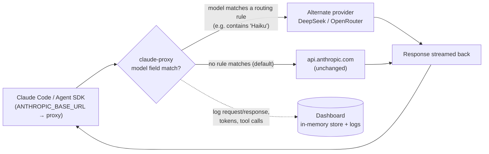

# Claude Proxy Monitor

One-click start, stop, and configure the [claude-proxy](https://github.com/TiepHoangDev/claude-proxy) reverse proxy without leaving VS Code.

The extension auto-downloads the latest release binary, starts the proxy locally, and sets `ANTHROPIC_BASE_URL` in your integrated terminal so Claude tools (Claude Code, Claude Agent SDK) route through the proxy transparently.

## How it works

claude-proxy sits between your Claude tools and `api.anthropic.com`. Every request passes through it unchanged by default — it only reroutes a request when its `model` field matches a rule you configure (e.g. send `deepseek-*` calls to DeepSeek instead of Claude). Everything else is forwarded to Anthropic as-is, while the proxy records tokens, tool calls, and full request/response content for the dashboard.

Two capabilities come out of this:

### 1. Proxy — selective request routing

- Requests are forwarded to `api.anthropic.com` untouched **unless** the request's `model` matches a configured rule.
- Matching rules (configured on the Setup page) redirect just that request to DeepSeek or OpenRouter, with the target `model` swapped in — other requests keep going to Anthropic normally.
- Routing is re-read from `config.json` on every request, so changes made in Setup apply immediately, without restarting.
- Optional system-prompt injection can also be scoped to a model match.

### 2. Monitor — live dashboard

- **Request list** — every request that passes through the proxy (to Anthropic or an alternate provider) shows up in a live, auto-refreshing list with model, token usage, and tool names.
- **Request detail** — click into any request to see the full conversation timeline: system prompt, user/assistant turns, tool calls and their results, and token/cache usage for that exchange.
- Status bar surfaces running state, port, rate-limit usage, and DeepSeek balance without opening the dashboard at all.

## Features

- **Auto-download** — fetches the correct platform binary from GitHub Releases on first start
- **Status bar** — running state, port, rate-limit usage, and DeepSeek balance at a glance
- **One-click commands** — Start, Stop, Restart, Open Dashboard, Open Setup, Show Logs, Check for Update
- **Health monitoring** — polls the proxy's health endpoint every 60s and surfaces rate-limit warnings and Claude subscription usage in the status bar
- **Auto-config** — sets `ANTHROPIC_BASE_URL` in your terminal environment on start, restores it on stop

## Commands

Open the Command Palette (`Ctrl+Shift+P`) and type "Claude Proxy":

| Command | Description |
|---|---|
| **Start** | Download the latest binary and start the proxy |
| **Stop** | Stop the running proxy |
| **Restart** | Stop then start again |
| **Open Dashboard** | Open the request dashboard in your browser |
| **Open Setup / Config** | Open the config page (routing rules, API keys) |
| **Show Logs** | View proxy output in the VS Code Output panel |
| **Check for Binary Update** | Stop the proxy, download the latest binary, restart |

## Settings

- `claudeProxy.port` — port the proxy listens on (default `8080`)
- `claudeProxy.autoStart` — start the proxy automatically when VS Code opens (default `false`)
- `claudeProxy.devBinary` — path to a local dev binary; when set, skips GitHub download entirely

## Requirements

- Windows or Linux (amd64)
- No other process on the configured port

## GitHub

https://github.com/TiepHoangDev/claude-proxy
